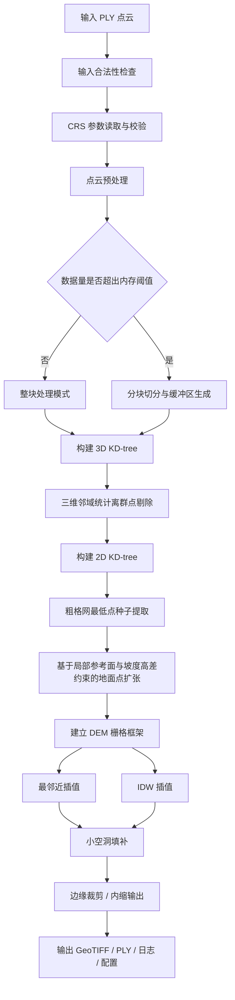

# 光学测绘卫星点云生成 DEM 程序开发最终方案

## 1. 文档定位

本文档用于指导一个完整、可直接落地的 DEM 生成程序设计与实现。程序目标是：

**输入光学测绘卫星摄影测量点云，完成预处理、空间索引建立、离群点剔除、地面点提取、DEM 栅格化插值和 ArcGIS 可直接读取结果输出。**

---

## 2. 程序最终目标

程序一次运行应具备以下完整能力：

1. 读取 PLY 点云文件；
2. 检查并规范化点云数据；
3. 构建二维与三维两类空间索引；
4. 基于三维邻域统计剔除离群噪声点；
5. 基于粗格网最低点初始化地面种子；
6. 基于平面邻域、局部参考面及坡度/高差约束提取地面点；
7. 建立规则 DEM 栅格框架；
8. 基于地面点执行最邻近插值生成 DEM；
9. 基于地面点执行 IDW 插值生成 DEM；
10. 对 DEM 中的小面积空洞进行可控填补；
11. 输出带空间参考的 GeoTIFF；
12. 输出中间结果点云、参数文件和日志文件；
13. 在数据量超出内存阈值时，支持切换到分块处理框架。

本方案同时支持 **最邻近插值** 和 **IDW 插值** 两种方法：

- **最邻近插值**：用于快速生成、保持原始点值、不引入平滑；
- **IDW 插值**：作为默认主方法，用于生成连续性更好的 DEM。

---

## 3. 核心修订原则

### 3.1 二维与三维索引必须分离

程序中不再使用“单一 KD-tree 覆盖所有阶段”的设计。必须维护两套索引：

- **3D KD-tree**：基于 `(x, y, z)` 建树，用于三维真实空间距离计算；
- **2D KD-tree**：基于 `(x, y)` 建树，用于平面邻域查询。

禁止在离群点剔除阶段使用 2D KD-tree 替代 3D KD-tree。否则会出现高空飞点在平面上与地面点重合、但实际应被剔除却未剔除的严重错误。

### 3.2 地面参考高程不能只用简单均值

在复杂地形中，单纯以邻域地面点加权平均高程作为参考值，容易造成“削峰填谷”。因此本版采用：

- **优先使用局部拟合平面作为参考面**；
- 当局部平面拟合不稳定时，退化为**非线性距离加权高程估计**；
- 对于特殊保守模式，可启用**局部最低点参考**。

即：参考高程采用**分级策略**，而不是固定死板的单一平均值。

### 3.3 CRS 必须作为显式输入

由于 PLY 通常不携带坐标参考信息，程序不能假定输入点云自带 CRS。输出 GeoTIFF 时，空间参考必须来自配置文件中的显式参数。

### 3.4 体系结构必须为大数据预留扩展口

尽管初期版本允许以内存可承载数据为主，但架构层必须预留 **Tile-based Processing** 接口，包括：

- 分块切分
- 缓冲区生成
- 分块独立处理
- 栅格拼接
- 边界裁剪

### 3.5 边缘区域必须区别对待

边界邻域天然不完整，因此边缘点和边缘像元不能与内部区域采用完全相同的判定策略。程序必须提供：

- 点级边缘标识；
- 栅格级内缩输出选项；
- 邻域完整度判断；
- 边缘结果掩膜输出。

---

## 4. 最终程序架构

程序采用固定的八层结构：

1. 输入层
2. 预处理层
3. 空间参考管理层
4. 空间索引层
5. 点云滤波与地面点提取层
6. DEM 生成层
7. 分块调度层
8. 输出层

对应模块如下：

- `InputManager`：输入点云读取与检查
- `PreprocessEngine`：数据清洗与规范化
- `CRSManager`：空间参考读取、校验与输出写入
- `SpatialIndexManager`：2D / 3D KD-tree 构建与查询统一管理
- `GroundFilterEngine`：离群点剔除与地面点提取
- `DEMEngine`：栅格框架建立、最邻近插值、IDW 插值、空洞处理
- `TileManager`：超大点云的分块切分、缓冲区扩展、结果拼接
- `OutputManager`：GeoTIFF、PLY、日志、配置输出

程序主控制器统一调度上述模块，不允许模块间职责交叉。

---

## 5. 最终技术路线

该流程即程序固定主线，不再拆分主方案与备选方案。

---

## 6. 输入规范

### 6.1 输入文件格式

程序主输入统一使用 PLY 点云文件。

最低要求字段：

- `x`
- `y`
- `z`

可忽略但允许存在的字段：

- `red`
- `green`
- `blue`
- `intensity`
- `classification`
- 其他附加属性

程序只依赖 `x, y, z` 三个字段完成 DEM 生成。

### 6.2 输入约束

输入点云必须满足：

1. 所有点在同一坐标系统下；
2. 平面坐标单位与 DEM 分辨率单位一致；
3. Z 值为可直接使用的高程值；
4. 文件头信息可正确解析；
5. 输入数据量要么可由当前内存承载，要么允许进入分块模式。

### 6.3 输入检查内容

程序启动后必须立即完成以下检查：

1. 文件是否存在；
2. 文件是否可打开；
3. PLY 头部是否完整；
4. 是否存在 `x/y/z` 字段；
5. 点数是否大于 0；
6. 是否存在 NaN、Inf；
7. 是否存在明显异常极值；
8. 是否存在大量重复点；
9. 是否存在坐标顺序混乱问题；
10. 是否提供空间参考参数；
11. 估算数据规模是否超出整块处理阈值。

若任一必要条件不满足，程序应终止并给出明确错误信息。

---

## 7. 空间参考管理设计

### 7.1 设计目标

确保输出 GeoTIFF 具有明确、可被 ArcGIS 直接识别的空间参考。

### 7.2 设计原则

由于 PLY 通常不包含 CRS 信息，因此程序必须从外部配置中读取空间参考。

### 7.3 CRS 输入方式

`DEMConfig` 中必须至少支持以下三种方式之一：

1. `epsg_code`：显式 EPSG 编号；
2. `crs_wkt`：WKT 字符串；
3. `crs_wkt_file`：WKT 文件路径。

优先级建议：

- `crs_wkt` > `crs_wkt_file` > `epsg_code`

### 7.4 输出要求

输出 GeoTIFF 时必须写入：

1. GeoTransform；
2. CRS / Projection；
3. NoData；
4. 数据类型；
5. 行列数。

若用户未提供任何空间参考，则程序默认禁止输出正式 GeoTIFF，并给出错误提示；仅在显式允许 `allow_unknown_crs = true` 时，才允许输出无投影文件，同时日志中必须写出“未知空间参考”。

---

## 8. 核心数据结构设计

### 8.1 点结构 `Point3D`

字段建议：

- `double x`
- `double y`
- `double z`
- `uint32_t index`
- `bool valid`
- `bool outlier`
- `bool ground`
- `bool edge_point`

可扩展字段：

- `double local_mean_dist_3d`
- `double local_height_diff`
- `double local_slope`
- `double reference_z`
- `double neighborhood_completeness`

### 8.2 点云容器 `PointCloud`

应包含：

- 点数组
- 点数量
- 属性描述
- 包围盒
- 统计信息
- 是否已建立 2D 索引标志
- 是否已建立 3D 索引标志

### 8.3 包围盒 `Bounds`

字段：

- `xmin`
- `xmax`
- `ymin`
- `ymax`
- `zmin`
- `zmax`

### 8.4 栅格结构 `RasterGrid`

字段：

- `rows`
- `cols`
- `cell_size`
- `origin_x`
- `origin_y`
- `nodata`
- `values`
- `valid_mask`
- `edge_mask`

### 8.5 参数结构 `DEMConfig`

必须集中管理所有参数，至少包括：

#### 输入与输出

- 输入文件路径
- 输出目录
- 是否启用分块处理
- 内存阈值
- 分块大小
- 分块缓冲宽度

#### CRS 参数

- `epsg_code`
- `crs_wkt`
- `crs_wkt_file`
- `allow_unknown_crs`

#### 离群点剔除

- `outlier_knn`
- `outlier_stddev`
- `outlier_use_robust_stat`

#### 地面点提取

- `seed_grid_size`
- `ground_knn`
- `ground_search_radius`
- `max_height_diff`
- `max_slope_deg`
- `max_iterations`
- `min_ground_neighbors`
- `reference_mode`
- `reference_fallback_mode`
- `distance_weight_power`

#### DEM 生成

- `cell_size`
- `nearest_max_distance`
- `idw_radius`
- `idw_max_points`
- `idw_min_points`
- `idw_power`
- `nodata`

#### 边缘控制

- `edge_shrink_cells`
- `enable_edge_mask`
- `min_neighbor_completeness`

#### 空洞填补

- `fill_holes`
- `fill_max_radius`
- `fill_min_neighbors`

---

## 9. 预处理层设计

### 9.1 功能目标

预处理层负责清理原始点云中的无效点和明显不合理点，使后续索引构建和滤波过程稳定可靠。

### 9.2 固定步骤

预处理必须严格按以下顺序执行：

1. 删除 NaN 点；
2. 删除 Inf 点；
3. 删除完全重复点；
4. 删除明显异常极端点；
5. 重新编号点索引；
6. 更新包围盒；
7. 估算平均点间距与点密度；
8. 估算内存需求，决定整块或分块处理。

### 9.3 异常极值处理规则

异常极值不能依赖人工主观判断，应基于统计约束自动处理。推荐规则：

- 坐标明显脱离整体范围的点判为异常；
- Z 值远超总体分布且局部空间不连续的点判为异常；
- 极端点删除比例必须写入日志；
- 预处理阶段只删除“明显异常值”，不把一般离群点处理提前到该阶段。

### 9.4 预处理输出要求

预处理后输出：

- 清洗后点数；
- 删除 NaN 数；
- 删除 Inf 数；
- 删除重复点数；
- 删除异常点数；
- 平均点间距估计值；
- 预处理耗时。

---

## 10. 空间索引层设计

### 10.1 功能目标

为空间查询提供统一、高效、阶段明确的索引支持。

### 10.2 双索引体系

程序中必须维护以下两类索引：

#### 10.2.1 3D KD-tree

基于 `(x, y, z)` 构建，用于：

- 离群点剔除；
- 三维真实欧氏距离计算；
- 高空噪声点识别；
- 局部空间孤立性判断。

#### 10.2.2 2D KD-tree

基于 `(x, y)` 构建，用于：

- 地面点平面邻域查询；
- DEM 栅格中心点邻域搜索；
- 最邻近插值；
- IDW 插值；
- 边缘邻域完整度估计。

### 10.3 必备接口

#### KNN 查询

输入：

- 查询点坐标
- 邻居数量 K
- 查询维度类型（2D / 3D）

输出：

- 邻居索引列表
- 对应距离列表

#### 半径查询

输入：

- 查询点坐标
- 搜索半径 r
- 最大返回数量
- 查询维度类型（2D / 3D）

输出：

- 邻域点索引列表
- 对应距离列表

### 10.4 索引使用原则

程序中索引使用规则固定如下：

- **离群点剔除**：只允许使用 3D KD-tree；
- **地面点提取**：只允许使用 2D KD-tree 查询平面邻域；
- **DEM 插值**：只允许使用 2D KD-tree；
- **边缘完整度估计**：使用 2D KD-tree；
- 同一阶段内不得重复无意义建树；
- 只有在点集发生实质变化时才允许重建索引。

---

## 11. 离群点剔除模块设计

### 11.1 模块目标

剔除局部孤立、明显噪声和空间不连续点，防止其影响地面点提取和 DEM 插值。

### 11.2 固定方法

采用**基于 3D 邻域统计的离群点剔除法**作为最终方法。

### 11.3 处理逻辑

对每个点执行：

1. 使用 **3D KD-tree** 查询 K 个近邻；
2. 计算该点到邻域点的三维平均距离；
3. 统计所有点三维平均距离的整体均值和标准差；
4. 若某点平均距离大于阈值，则标记为离群点；
5. 删除标记点，生成 `filtered_points.ply`。

### 11.4 鲁棒统计增强

为减少局部极端异常对全局统计的影响，建议支持鲁棒模式：

- 可选使用中位数与 MAD 替代均值与标准差；
- 对于噪声较多的数据，优先使用鲁棒模式；
- 默认实现仍可采用均值 + 标准差，但接口需预留。

### 11.5 固定参数建议

推荐默认值：

- `outlier_knn = 16`
- `outlier_stddev = 1.5`
- `outlier_use_robust_stat = false`

### 11.6 设计要求

- 必须使用 3D 距离而非 2D 距离；
- 必须输出被剔除点数量；
- 必须输出剔除比例；
- 必须输出剔除后点数；
- 必须记录处理耗时；
- 不得将离群点剔除与地面点提取混为一体。

---

## 12. 地面点提取模块设计

### 12.1 模块目标

在离群点已剔除的条件下，从点云中稳定提取地面点集合，为 DEM 提供唯一高程来源。

### 12.2 最终方法

采用以下固定两阶段方法：

1. **粗格网最低点种子提取**
2. **基于平面邻域、局部参考面及坡度/高差约束的地面点迭代扩张**

这是本程序的唯一地面点提取方案。

---

## 13. 初始种子提取设计

### 13.1 目标

快速从全局点云中抽取最可能属于地面的初始种子点。

### 13.2 处理规则

1. 用粗分辨率格网覆盖整个研究区；
2. 每个粗格网单元中选取 Z 最小点；
3. 将这些最低点作为初始地面种子；
4. 合并所有种子点形成初始地面集合。

### 13.3 固定参数建议

推荐：

- `seed_grid_size = 3 × cell_size`

### 13.4 设计要求

- 空格网不生成种子；
- 每个格网只保留一个最低点；
- 初始种子点数量必须写入日志；
- 初始种子点应支持单独输出。

---

## 14. 地面点迭代扩张设计

### 14.1 目标

在初始地面种子基础上，将符合地形连续性的点逐步并入地面点集合。

### 14.2 迭代规则

对每个未分类点：

1. 在当前地面点集合上建立 **2D KD-tree**；
2. 查询其平面邻域地面点；
3. 若邻域地面点数不足，则暂不加入；
4. 计算局部参考高程或局部参考面；
5. 计算候选点相对参考面的高差；
6. 计算候选点相对参考面的局部坡度；
7. 若同时满足高差阈值和坡度阈值，则将其标记为地面点；
8. 完成一轮后更新地面点集合；
9. 继续下一轮，直到满足停止条件。

### 14.3 参考高程计算方式

本版不再固定使用“简单加权平均高程”，而采用以下优先级策略：

#### 一级：局部拟合平面参考

当邻域地面点数量充足且分布稳定时：

- 使用邻域地面点拟合局部平面；
- 以候选点平面位置在该平面上的预测高程作为参考高程；
- 局部坡度直接由拟合平面估计。

该方法更适合复杂地形，可减少削峰填谷问题。

#### 二级：非线性距离加权参考

当局部平面拟合条件不稳定时：

- 采用邻域地面点的距离加权高程；
- 距离权重不再使用简单反比，而采用更强的非线性权重；
- 推荐使用反平方权重，即 `w = 1 / d^2`。

这样可增强近邻控制能力，减弱远点对山脊、陡坎、高差突变位置的平滑作用。

#### 三级：局部最低点保守模式

若数据局部非常复杂、邻域点少或拟合退化：

- 允许退化为局部最低点参考；
- 该模式更保守，有利于避免将明显高于地面的点误并入地面类。

### 14.4 推荐实现策略

默认推荐：

- `reference_mode = local_plane`
- `reference_fallback_mode = inverse_distance_squared`

即：优先用局部平面，失败时退化为反平方加权高程。

### 14.5 局部坡度计算方式

局部坡度统一基于候选点与参考面的高差、平面距离或局部平面参数计算，禁止使用粗糙的全局坡度近似。

### 14.6 固定参数建议

推荐默认值：

- `ground_knn = 8`
- `ground_search_radius = 3 × cell_size`
- `max_height_diff = 1.0`
- `max_slope_deg = 20.0`
- `max_iterations = 6`
- `min_ground_neighbors = 3`
- `distance_weight_power = 2.0`

### 14.7 停止条件

满足以下任一条件即停止：

1. 达到最大迭代次数；
2. 当前轮新增地面点数为 0；
3. 当前轮新增地面点比例低于极小阈值。

### 14.8 输出结果

必须输出：

- 最终地面点数；
- 非地面点数；
- 每轮新增地面点数量；
- 地面点比例；
- 地面点提取总耗时。

---

## 15. DEM 栅格框架设计

### 15.1 目标

将最终地面点映射到统一规则栅格，为插值计算和结果写出提供标准空间框架。

### 15.2 范围确定

DEM 范围以最终地面点包围盒为基础，但不直接机械使用外边界，而采用**边缘控制策略**：

#### 基础范围

- 左边界：`xmin`
- 右边界：`xmax`
- 下边界：`ymin`
- 上边界：`ymax`

#### 输出范围修正

为避免边缘邻域不完整引起伪影，程序必须支持内缩输出：

- `edge_shrink_cells = 0 / 0.5 / 1.0 / 自定义`

默认建议：

- `edge_shrink_cells = 1`

即 DEM 输出范围相对于原始包围盒向内收缩 1 个像元，边缘外层像元可直接标记为 NoData 或不纳入正式输出。

### 15.3 分辨率设计

最终方案中 DEM 分辨率采用固定配置参数 `cell_size`。

推荐默认值：

- `cell_size = 平均点间距的 1.5 倍`

若无法稳定估计平均点间距，则采用用户显式指定。

### 15.4 行列数计算

- `cols = ceil((xmax_out - xmin_out) / cell_size)`
- `rows = ceil((ymax_out - ymin_out) / cell_size)`

### 15.5 栅格原点约定

统一采用左上角原点约定：

- `origin_x = xmin_out`
- `origin_y = ymax_out`

### 15.6 NoData 设计

推荐固定：

- `nodata = -9999`

### 15.7 边缘掩膜

建议同时输出 `dem_edge_mask.tif` 或在 `dem_mask.tif` 中编码边缘信息，以便后续人工检查时识别边缘不可靠区域。

---

## 16. 最邻近插值模块设计

### 16.1 模块目标

根据最终地面点，为 DEM 栅格中的每个像元中心直接赋予最近地面点的高程值。

### 16.2 最终插值规则

对每个栅格中心点执行：

1. 使用最终地面点 **2D KD-tree** 进行最近邻查询；
2. 获取距离最近的一个地面点；
3. 若最近邻距离超过允许阈值，则输出 NoData；
4. 若该像元位于边缘低完整度区，则可选择保持 NoData；
5. 否则将最近地面点的 Z 值赋给当前像元。

### 16.3 固定查询策略

统一采用：

- 主查询方式：1 近邻查询
- 辅助约束：最大允许邻域距离
- 边缘约束：邻域完整度不足时禁止强制赋值

### 16.4 固定参数建议

推荐默认值：

- `nearest_max_distance = 3 × cell_size`
- `min_neighbor_completeness = 0.5`

### 16.5 方法特点

最邻近插值具有以下特点：

- 计算速度快；
- 不做平滑；
- 输出值直接来自地面点；
- 边界清晰，但表面连续性较弱；
- 适合快速浏览、保持原始点值及与 IDW 结果对照。

---

## 17. IDW 插值模块设计

### 17.1 模块目标

根据最终地面点，为 DEM 栅格中的每个像元中心估计高程值。

### 17.2 最终插值规则

对每个栅格中心点执行：

1. 使用最终地面点 **2D KD-tree** 进行邻域查询；
2. 优先采用“半径搜索 + 最多 K 点限制”的方式取样；
3. 若邻域点数小于最小阈值，则输出 NoData；
4. 若存在距离为 0 的样本点，则直接取该点高程；
5. 否则按距离反比幂函数计算权重；
6. 对邻域点高程进行加权平均；
7. 若像元位于边缘低完整度区，则优先输出 NoData，避免伪影；
8. 将结果写入栅格。

### 17.3 固定查询策略

统一采用：

- 主查询方式：半径搜索
- 辅助约束：最多 K 点
- 边缘约束：低完整度区域不做强行外推

### 17.4 固定参数建议

推荐默认值：

- `idw_radius = 3 × cell_size`
- `idw_max_points = 12`
- `idw_min_points = 3`
- `idw_power = 2.0`

### 17.5 数值稳定规则

必须处理以下情况：

#### 距离为 0

直接赋值，不做加权。

#### 距离极小

设置极小值阈值，避免权重溢出。

#### 邻域不足

直接输出 NoData。

#### 邻域过密

只使用最近的最多 K 个点。

#### 边缘邻域不完整

不允许利用单侧稀疏邻域进行强行平滑外推。

### 17.6 插值效率要求

- 插值时只允许使用最终地面点 2D 索引；
- 不允许逐栅格重复建树；
- 应按行或按块组织计算；
- 所有耗时必须统计。

---

## 18. DEM 空洞处理设计

### 18.1 目标

对插值后形成的小面积空洞进行有限、可控的填补，提升 DEM 连续性，但不得破坏地形结构。

### 18.2 处理原则

空洞处理只允许用于：

- 零散小空洞
- 邻近有效像元充足
- 不影响主地形趋势的区域

不允许用于：

- 大面积空白区
- 数据本身缺失严重区域
- 边缘外推区域
- 边界低完整度区域

### 18.3 固定方法

采用**邻近有效像元局部均值填补法**：

1. 对 NoData 像元搜索其周围有效像元；
2. 若有效邻域数量达到阈值，则以局部均值填补；
3. 若不足，则继续保持 NoData；
4. 若该 NoData 像元位于边缘低完整度区域，则不填补。

### 18.4 固定参数建议

推荐默认值：

- `fill_max_radius = 2 cells`
- `fill_min_neighbors = 4`

### 18.5 输出要求

必须分别输出：

- 原始插值 DEM：`dem_nearest.tif`、`dem_idw.tif`
- 填补后 DEM：`dem_nearest_filled.tif`、`dem_idw_filled.tif`

不得覆盖原始插值结果。

---

## 19. 分块处理架构设计

### 19.1 设计目标

为大规模点云提供可扩展处理能力，避免整块加载造成内存溢出。

### 19.2 启动条件

满足以下任一条件时，应切换分块模式：

1. 预估点数超过整块处理阈值；
2. 预估内存占用超过允许上限；
3. 用户显式启用 `tile_mode = true`。

### 19.3 分块基本原则

1. 按平面坐标将研究区切分为规则 Tile；
2. 每个 Tile 在实际处理时必须带缓冲区 `tile_buffer`；
3. 离群点剔除、地面点提取、插值均在“主块 + 缓冲区”范围内进行；
4. 输出时只保留 Tile 主区结果，丢弃缓冲边缘；
5. 所有 Tile 处理完成后再进行拼接。

### 19.4 推荐参数

- `tile_size = 1000 × 1000 cells` 或按空间尺度配置
- `tile_buffer = max(3 × cell_size, idw_radius, ground_search_radius)`

### 19.5 分块流程

1. 统计全局包围盒；
2. 根据块大小划分 Tile；
3. 为每块构造主区与缓冲区范围；
4. 提取该范围点集；
5. 在该子点集上执行完整流程；
6. 仅输出主区 DEM；
7. 最终拼接所有 Tile DEM；
8. 必要时生成全局掩膜与边界接缝检查结果。

### 19.6 设计要求

- Tile 间必须有缓冲；
- 禁止无缓冲分块直接拼接；
- 日志中必须记录块数、块大小、缓冲宽度与拼接耗时；
- 分块模式与整块模式应共享同一算法接口，避免出现两套逻辑。

---

## 20. 输出层设计

### 20.1 点云输出

应支持输出以下 PLY 文件：

- `filtered_points.ply`：剔除离群点后的点云
- `ground_points.ply`：地面点云
- `nonground_points.ply`：非地面点云

要求：

1. 保留 `x/y/z`；
2. 输出点数与程序统计一致；
3. 文件可再次读回验证；
4. 输出顺序可不必与原始完全一致。

### 20.2 GeoTIFF 输出

输出流程必须包括：

1. 创建栅格文件；
2. 写入行列数；
3. 写入像元类型；
4. 写入 GeoTransform；
5. 写入 CRS；
6. 写入 NoData；
7. 写入栅格数组；
8. 正常关闭文件。

### 20.3 必须输出文件

#### DEM 结果文件

- `dem_nearest.tif`
- `dem_idw.tif`
- `dem_nearest_filled.tif`
- `dem_idw_filled.tif`
- `dem_mask.tif`
- `dem_edge_mask.tif`（建议）

#### 中间点云文件

- `filtered_points.ply`
- `ground_points.ply`
- `nonground_points.ply`

#### 管理文件

- `run_log.txt`
- `config_used.txt`
- `stats.txt`

### 20.4 ArcGIS 兼容输出要求

GeoTIFF 必须包含：

1. 正确的行列数；
2. 正确的像元大小；
3. 正确的原点坐标；
4. 正确的仿射变换；
5. 明确的 NoData 值；
6. 正确的数据类型；
7. 明确的坐标参考信息。

程序不需要实现 ArcGIS 对比分析功能，只需保证输出结果可直接加载并显示。

---

## 21. 程序主控制流程

最终程序主控制流程固定如下：

1. 读取配置；
2. 校验配置合法性；
3. 读取点云；
4. 执行输入检查；
5. 读取并校验 CRS 参数；
6. 执行预处理；
7. 判断整块或分块处理模式；
8. 若为整块模式，则直接进入主流程；
9. 若为分块模式，则完成 Tile 切分与缓冲区生成；
10. 对处理单元构建 3D KD-tree；
11. 执行三维离群点剔除；
12. 在剔除后的点集上构建 2D KD-tree；
13. 提取初始地面种子；
14. 执行地面点迭代扩张；
15. 生成最终地面点集合；
16. 建立最终地面点 2D KD-tree；
17. 创建 DEM 栅格框架；
18. 执行最邻近插值；
19. 执行 IDW 插值；
20. 执行空洞处理；
21. 执行边缘裁剪或内缩输出；
22. 输出 GeoTIFF；
23. 输出中间点云；
24. 输出日志和统计；
25. 若为分块模式，则执行结果拼接；
26. 释放资源并结束。

---

## 22. 参数体系最终建议

### 22.1 CRS 参数

- `epsg_code = 必填或可替代`
- `allow_unknown_crs = false`

### 22.2 离群点剔除

- `outlier_knn = 16`
- `outlier_stddev = 1.5`
- `outlier_use_robust_stat = false`

### 22.3 地面点提取

- `seed_grid_size = 3 × cell_size`
- `ground_knn = 8`
- `ground_search_radius = 3 × cell_size`
- `max_height_diff = 1.0`
- `max_slope_deg = 20.0`
- `max_iterations = 6`
- `min_ground_neighbors = 3`
- `reference_mode = local_plane`
- `reference_fallback_mode = inverse_distance_squared`
- `distance_weight_power = 2.0`

### 22.4 DEM 生成

- `nodata = -9999`
- `nearest_max_distance = 3 × cell_size`
- `idw_radius = 3 × cell_size`
- `idw_max_points = 12`
- `idw_min_points = 3`
- `idw_power = 2.0`

### 22.5 边缘控制

- `edge_shrink_cells = 1`
- `enable_edge_mask = true`
- `min_neighbor_completeness = 0.5`

### 22.6 空洞填补

- `fill_holes = true`
- `fill_max_radius = 2 cells`
- `fill_min_neighbors = 4`

### 22.7 分块处理

- `tile_mode = auto`
- `tile_buffer = max(idw_radius, ground_search_radius)`
- `memory_limit_mb = 用户配置`

---

## 23. 异常处理设计

### 23.1 输入异常

程序必须显式处理：

- 文件不存在；
- 文件不可读；
- PLY 头异常；
- 坐标字段缺失；
- 点数为 0；
- CRS 参数缺失。

### 23.2 参数异常

程序必须禁止：

- `cell_size <= 0`
- `idw_radius <= 0`
- `idw_power <= 0`
- `outlier_knn < 1`
- `ground_knn < 1`
- `max_iterations < 1`
- `tile_buffer < 0`
- 输出目录不可写

### 23.3 算法异常

程序必须处理：

- 3D KD-tree 建树失败；
- 2D KD-tree 建树失败；
- 邻域查询为空；
- DEM 行列数过大导致内存不足；
- 分块拼接失败；
- 输出文件创建失败；
- 全部点被错误剔除；
- 最终无地面点可用于插值。

### 23.4 处理原则

- 关键错误立即终止；
- 可恢复问题写入警告后继续；
- 所有异常必须写入日志；
- 不允许静默失败。

---

## 24. 性能设计

### 24.1 性能重点

本程序的核心性能压力集中在：

1. 3D KNN 离群点查询；
2. 地面点迭代扩张中的 2D 邻域查询；
3. 栅格逐像元最邻近查询；
4. 栅格逐像元 IDW 查询；
5. 分块模式下的子块调度与拼接。

### 24.2 固定优化原则

1. 每个阶段只在必要时建树一次；
2. 离群点剔除只建一次 3D 树；
3. 地面点更新后按轮次重建 2D 索引；
4. 插值阶段只用最终地面点 2D 索引；
5. 栅格计算按行或按块遍历；
6. 查询结果容器复用，减少频繁分配；
7. 控制邻域上限，避免超大搜索集合；
8. 大数据自动转入分块模式。

### 24.3 内存控制要求

- 点云数据仅保留必要字段；
- 中间状态尽量用标记位而非复制整份点集；
- 栅格数据采用连续内存；
- 分块模式下禁止同时加载全部块中间结果；
- 输出后及时释放无用缓存。

---

## 25. 统计信息设计

程序必须输出以下统计：

### 25.1 原始输入统计

- 原始点数
- 坐标范围
- 文件读取耗时
- 平均点间距估计
- 是否进入分块模式

### 25.2 预处理统计

- NaN 删除数
- Inf 删除数
- 重复点删除数
- 异常极值删除数
- 预处理后点数

### 25.3 离群点统计

- 离群点数量
- 离群点比例
- 剔除后点数
- 3D KNN 查询耗时

### 25.4 地面点统计

- 初始种子点数
- 每轮新增地面点数
- 最终地面点数
- 非地面点数
- 地面点比例
- 参考模式使用次数统计

### 25.5 DEM 统计

- DEM 行数与列数
- 分辨率
- 边缘内缩宽度
- 最邻近 DEM NoData 数量与比例
- 最邻近填补后 NoData 数量与比例
- IDW DEM NoData 数量与比例
- IDW 填补后 NoData 数量与比例
- 边缘掩膜像元数量与比例

### 25.6 分块统计

- Tile 数量
- Tile 主区尺寸
- Tile 缓冲宽度
- Tile 拼接耗时

### 25.7 时间统计

- 总耗时
- 预处理耗时
- 3D KD-tree 建树耗时
- 2D KD-tree 建树耗时
- 离群点剔除耗时
- 地面点提取耗时
- 插值耗时
- 空洞填补耗时
- 拼接耗时
- 输出耗时

---

## 26. 最终目录组织建议

建议程序运行目录使用如下结构：

- `input/`：原始点云
- `output/`：所有结果
- `output/pointcloud/`：PLY 结果
- `output/dem/`：GeoTIFF 结果
- `output/log/`：日志与统计
- `output/tile/`：分块临时结果
- `config/`：配置文件

输出目录下建议使用统一实验名或时间戳子目录，避免多次运行互相覆盖。

---

## 27. 最终程序验收标准

程序满足以下条件即可视为完成：

1. 能稳定读取 PLY 点云；
2. 能自动完成输入检查和预处理；
3. 能同时构建 3D 与 2D KD-tree；
4. 能基于 3D 邻域稳定剔除离群点；
5. 能提取地面点并输出地面/非地面点云；
6. 能建立 DEM 栅格框架；
7. 能基于最邻近插值生成 DEM；
8. 能基于 IDW 生成 DEM；
9. 能对小空洞进行可控填补；
10. 能输出带空间参考的 GeoTIFF；
11. 能处理边缘区域并输出边缘掩膜；
12. 能输出完整日志、配置和统计信息；
13. 当数据量过大时，能切换到分块处理模式；
14. 整个流程运行稳定，不崩溃、不静默失败。

---

## 28. 最终结论

本程序的最终修订方案固定为：

**PLY 点云输入 → 输入检查与 CRS 校验 → 预处理 → 基于 3D KD-tree 的邻域统计离群点剔除 → 基于 2D KD-tree 的粗格网最低点种子提取 → 基于局部拟合平面 / 非线性距离加权参考面的地面点迭代扩张 → 建立规则 DEM 栅格并执行边缘内缩控制 → 基于最终地面点的最邻近插值与 IDW 插值 → 小空洞局部均值填补 → 输出带空间参考的 GeoTIFF、中间点云、边缘掩膜和日志文件；当数据规模过大时，使用带缓冲区的分块处理与拼接框架。**

该方案相较上一版，具备以下改进：

1. 修复了离群点剔除中 2D KD-tree 的根本性漏洞；
2. 修正了复杂地形中参考高程“过度平滑”的问题；
3. 解决了 PLY 输入下 GeoTIFF 空间参考来源不明确的问题；
4. 为大规模卫星摄影测量点云预留了分块处理扩展口；
5. 将边缘效应纳入滤波、插值与 DEM 输出范围控制体系。

按照本方案实施，即可形成一套更稳健、更完整、更适合真实卫星点云数据规模的 DEM 生成程序开发基线。

