# DEM 生成器 - 项目详细介绍

> **项目名称**: dem_cli (DEM Command Line Interface)  
> **版本**: 0.1.0  
> **开发语言**: C++20  
> **构建系统**: CMake 3.24+  
> **许可证**: 学习与研究使用

---

## 目录

- [1. 项目背景与定位](#1-项目背景与定位)
- [2. 系统架构总览](#2-系统架构总览)
- [3. 核心技术栈](#3-核心技术栈)
- [4. 模块设计与职责](#4-模块设计与职责)
- [5. 数据流与处理流程](#5-数据流与处理流程)
- [6. 核心算法详解](#6-核心算法详解)
- [7. 空间索引与性能优化](#7-空间索引与性能优化)
- [8. 输出产物体系](#8-输出产物体系)
- [9. 配置系统设计](#9-配置系统设计)
- [10. 批量处理框架](#10-批量处理框架)
- [11. 质量控制机制](#11-质量控制机制)
- [12. 应用场景与优势](#12-应用场景与优势)
- [13. 未来扩展方向](#13-未来扩展方向)

---

## 1. 项目背景与定位

### 1.1 问题背景

在**光学测绘卫星摄影测量**领域，从立体影像匹配生成的密集点云数据中提取精确的数字高程模型（DEM/DTM）是一个关键且具有挑战性的任务：

- **数据特点**：卫星摄影测量点云通常密度不均、噪声较多，包含大量非地面点（建筑物、植被、车辆等）
- **处理需求**：需要高效、自动化的地面点提取算法，以及高质量的DEM插值方法
- **现有工具局限**：商业软件成本高昂，开源工具往往针对机载LiDAR优化，对卫星摄影测量点云的适配性不足

### 1.2 项目目标

本项目旨在提供一个**轻量级、高性能、易部署**的命令行工具，专门解决以下问题：

| 目标维度 | 具体实现 |
|----------|----------|
| **专业性** | 针对光学卫星摄影测量点云特性优化的地面滤波算法 |
| **自动化** | 全流程自动化处理，最小化人工干预 |
| **可配置** | 灵活的JSON配置系统 + 运行时参数覆盖 |
| **可扩展** | 模块化设计，便于添加新的算法和输出格式 |
| **可复现** | 完整的日志记录和参数回写机制 |

### 1.3 设计哲学

```
┌─────────────────────────────────────────────────────────────┐
│                     核心设计原则                              │
├─────────────────────────────────────────────────────────────┤
│  ✓ 单一职责    每个模块专注于一个明确的功能域                  │
│  ✓ 流水线架构   数据单向流动，阶段间通过明确定义的接口交互       │
│  ✓ 失败快速     尽早检测并报告错误，避免无效计算               │
│  ✓ 内存感知     自动评估数据规模，智能选择处理策略              │
│  ✓ 可观测性   详细的日志、统计和质量指标                       │
└─────────────────────────────────────────────────────────────┘
```

---

## 2. 系统架构总览

### 2.1 分层架构图

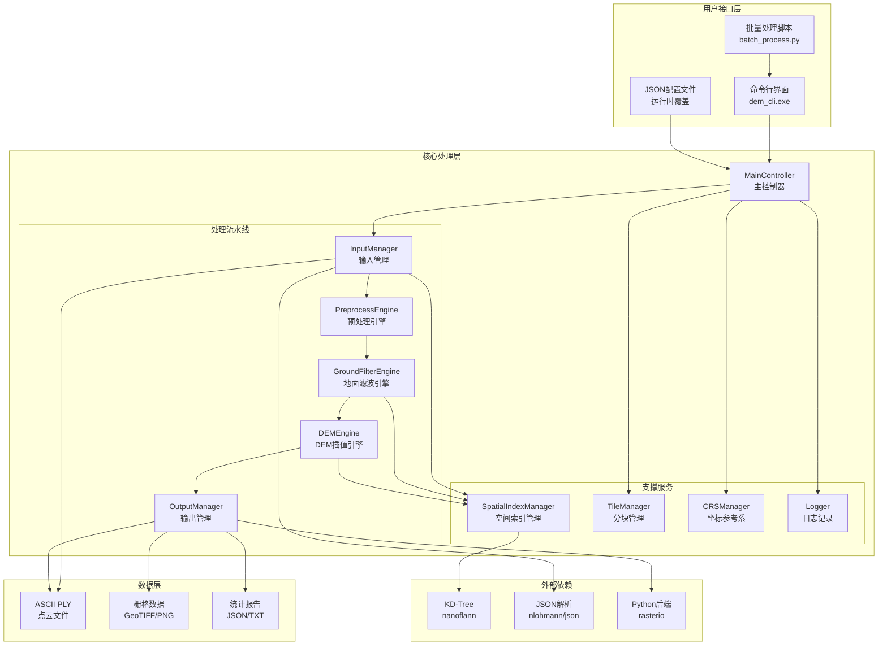

### 2.2 模块依赖关系

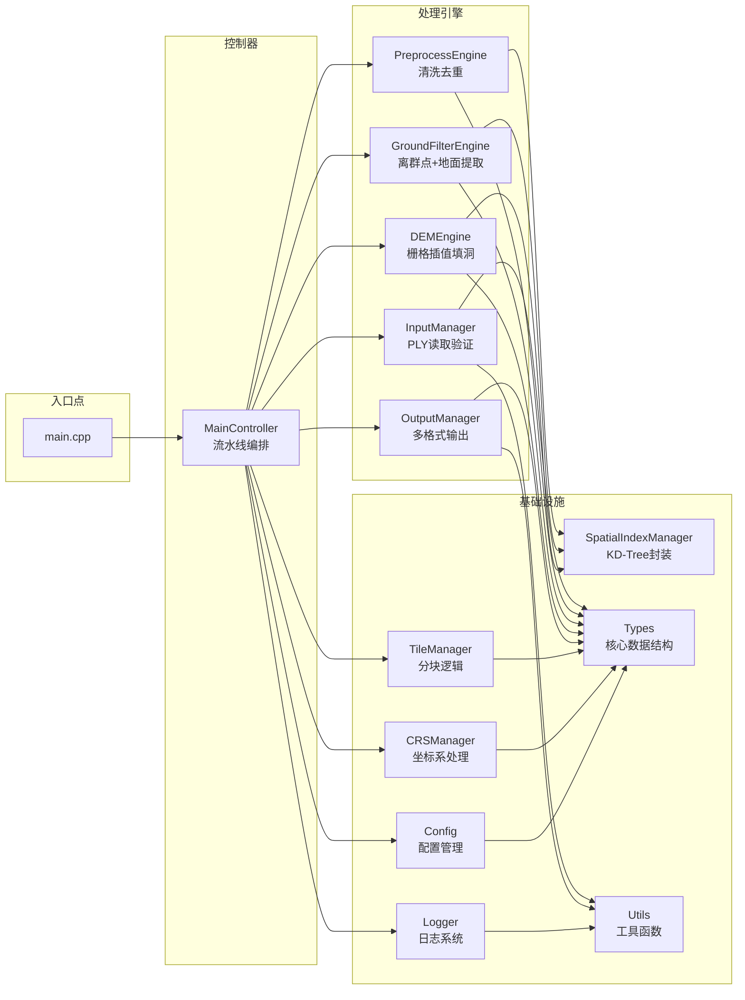

---

## 3. 核心技术栈

### 3.1 技术选型理由

| 技术组件 | 选择版本 | 选型理由 |
|----------|----------|----------|
| **C++20** | 强制要求 | Concepts、Ranges、format等现代特性提升代码表达力；编译期计算增强性能 |
| **CMake 3.24+** | 构建系统 | 广泛支持、跨平台；FetchContent简化依赖管理 |
| **MinGW g++ / GCC / Clang** | ≥ 11.0 | C++20支持完善；Windows下MinGW兼容性好 |
| **nanoflann v1.5.5** | KD-Tree库 | 头文件-only，零配置；高效的2D/3D近邻搜索 |
| **nlohmann/json v3.11.3** | JSON解析 | Intuitive API；现代化C++风格 |
| **doctest v2.4.12** | 测试框架 | 轻量级；头文件-only；易于集成 |
| **Python rasterio** | GeoTIFF后端 | 成熟的地理空间I/O库；GDAL生态集成 |
| **OpenMP** | 可选并行 | 编译器原生支持；KD-Tree查询并行化 |

### 3.2 依赖管理策略

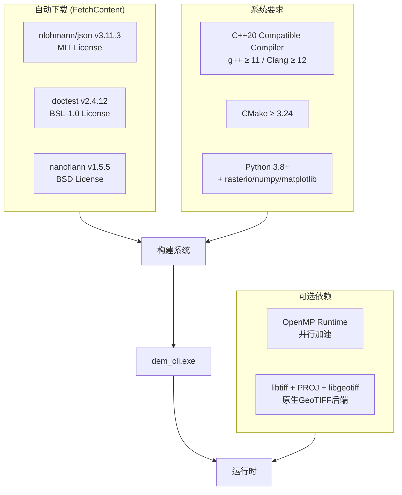

**关键优势**：
- **零配置起步**：用户只需安装编译器和CMake，其余依赖自动拉取
- **可重现构建**：所有第三方库版本锁定在CMakeLists.txt中
- **灵活降级**：GeoTIFF后端可在Python和原生库之间切换

---

## 4. 模块设计与职责

### 4.1 核心模块清单

#### 📁 MainController（主控制器）

**文件位置**: [MainController.hpp](include/dem/MainController.hpp), [MainController.cpp](src/MainController.cpp)

**职责**:
- 作为整个系统的入口点和编排器
- 管理完整的处理生命周期：初始化 → 处理 → 清理
- 协调各子模块的执行顺序和数据传递
- 支持单次处理和Tile分批处理两种模式
- 统一错误处理和资源释放

**关键方法**:

```cpp
class MainController {
public:
    /**
     * @brief 运行完整的DEM生成流程
     * 
     * 执行步骤：
     * 1. 加载并解析JSON配置文件
     * 2. 应用运行时参数覆盖（--set选项）
     * 3. 初始化日志系统和坐标参考系
     * 4. 读取并验证输入点云
     * 5. 根据数据规模决定是否启用Tile模式
     * 6. 执行完整处理流水线
     * 7. 输出结果并生成报告
     * 
     * @param config_path JSON配置文件路径
     * @param overrides 运行时配置覆盖列表
     * @return 退出码（0=成功，非0=失败）
     */
    int run(const std::filesystem::path& config_path, 
            const std::vector<std::string>& overrides);

private:
    /**
     * @brief 支持阶段：预处理 + 地面滤波 + 直落格
     * 
     * 此阶段仅产生点级分类结果和粗略的直落格栅格，
     * 不进行插值和精细化处理。用于Tile模式下各分块的独立处理。
     */
    ProcessingArtifacts processSupportStage(...);
    
    /**
     * @brief 收尾阶段：基于全局support构建最终DEM/DTM/QC产物
     * 
     * 在所有Tile的支持阶段完成后调用，
     * 利用全局信息进行插值、填洞、边缘掩码等操作。
     */
    void finalizeArtifacts(...);
};
```

#### 📁 InputManager（输入管理器）

**文件位置**: [InputManager.hpp](include/dem/InputManager.hpp)

**职责**:
- ASCII PLY文件的读取和解析
- 文件格式验证（header检查、属性列识别）
- 点云数据的内存表示构建
- 基本统计信息收集（点数、范围、属性可用性）

**支持的PLY属性**:
| 属性名 | 类型 | 必需 | 说明 |
|--------|------|------|------|
| `x`, `y`, `z` | float/double | ✅ | 三维坐标 |
| `intensity` | float/uint | ❌ | 回波强度（可选） |
| `red`, `green`, `blue` | uchar | ❌ | RGB颜色（可选） |
| `classification` | uchar/int | ❌ | 预分类标签（可选） |

#### 📁 PreprocessEngine（预处理引擎）

**文件位置**: [PreprocessEngine.hpp](include/dem/PreprocessEngine.hpp)

**职责**:
- **NaN/Inf清洗**: 移除数值异常的点
- **精确去重**: 基于XY坐标的重复点检测和合并
- **极端离群点剔除**: 使用分位数统计移除明显偏离的点
- **点间距估算**: 通过采样分析计算平均点间距

**预处理流程**:

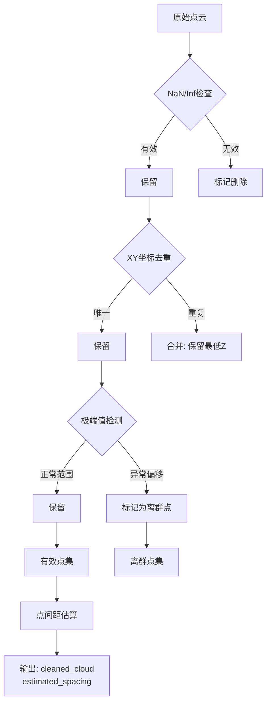

#### 📁 GroundFilterEngine（地面滤波引擎）

**文件位置**: [GroundFilterEngine.hpp](include/dem/GroundFilterEngine.hpp)

**职责**:
- **KNN离群点过滤**: 基于3D邻域统计的Statistical Outlier Removal (SOR)
- **种子点选取**: 在粗格网中选取低Z候选种子
- **迭代式地面扩张**: 多轮迭代的地面点增长算法
- **8扇区完整性校验**: 防止边缘误分类的空间分布检查

**这是整个系统的核心算法模块**，详见第6节。

#### 📁 DEMEngine（DEM插值引擎）

**文件位置**: [DEMEngine.hpp](include/dem/DEMEngine.hpp)

**职责**:
- **直落格栅格化**: 将点云投影到规则格网（每格取最低Z）
- **支撑栅格构建**: 从原始栅格推断有效支撑区域
- **DEM插值**: 最近邻/IDW两种插值方法
- **空洞填充**: 受限邻域均值填充NoData区域
- **DTM产物生成**: 分析型DTM + 展示型DTM + 对象掩膜
- **边缘掩码**: 结构性边缘检测和全局收缩

#### 📁 SpatialIndexManager（空间索引管理器）

**文件位置**: [SpatialIndexManager.hpp](include/dem/SpatialIndexManager.hpp)

**职责**:
- 封装nanoflann KD-Tree的创建和查询
- 提供2D和3D两种索引模式
- 支持K近邻搜索（KNN）和固定半径搜索
- 管理索引的生命周期和内存

**支持的查询类型**:

| 查询类型 | 用途 | 时间复杂度 |
|----------|------|-----------|
| 2D KNN | 地面滤波中的邻居查找 | O(log N) |
| 3D KNN | 离群点检测中的邻域统计 | O(log N) |
| 2D Radius Search | DEM插值中的邻域搜索 | O(log N + K) |
| 3D Radius Search | 密度估算 | O(log N + K) |

#### 📁 TileManager（分块管理器）

**文件位置**: [TileManager.hpp](include/dem/TileManager.hpp)

**职责**:
- 评估是否需要启用分块处理（基于内存阈值）
- 计算最优的Tile尺寸和数量
- 划分点云到各个Tile（含缓冲区重叠）
- 管理Tile间的边界协调

**分块触发条件**:
```
预估内存占用 = 点数 × sizeof(Point3D) × 安全系数
若 预估内存 > tile.memory_threshold_mb × 1024²
    → 启用Tile模式
```

#### 📁 OutputManager（输出管理器）

**文件位置**: [OutputManager.hpp](include/dem/OutputManager.hpp)

**职责**:
- PLY点云文件写入（filtered/seed/ground/nonground）
- GeoTIFF栅格文件生成（通过Python桥接）
- PNG可视化图像生成
- 统计报告输出（TXT + JSON格式）
- 配置参数回写（用于实验复现）

**输出桥接机制**:

```mermaid
sequenceDiagram
    participant C++ as C++ Engine
    participant BIN as .bin + .meta.json
    participant PY as write_geotiff.py
    participant TIF as GeoTIFF/PNG

    C++->>BIN: 序列化栅格数据为二进制
    C++->>BIN: 写入元数据（尺寸/范围/Nodata/CRS等）
    C++->>PY: 调用Python脚本（subprocess）
    PY->>BIN: 读取二进制数据和元数据
    PY->>TIF: 使用rasterio写入GeoTIFF
    PY->>TIF: 生成配色的PNG可视化
    PY-->>C++: 返回退出码
```

### 4.2 核心数据结构

#### Point3D（三维点）

```cpp
struct Point3D {
    double x, y, z;                    // 空间坐标
    std::uint32_t index;               // 全局索引
    bool valid;                        // 是否通过NaN/Inf检查
    bool outlier;                      // 是否被SOR判定为离群点
    bool ground;                       // 是否被分类为地面点
    bool edge_point;                   // 是否位于数据边缘
    
    // 算法中间结果
    double local_mean_dist_3d;         // 3D平均邻距（离群点检测用）
    double local_height_diff;          // 相对参考高度差
    double local_slope;                // 局部坡度（度）
    double reference_z;                // 地面参考高程
};
```

**设计考量**:
- 所有算法中间结果都存储在Point3D中，避免额外的数据结构
- 使用bool标记而非枚举，节省内存（关键处理百万级点云时）
- 中间结果可用于调试可视化和质量分析

#### Bounds（边界框）

```cpp
struct Bounds {
    double xmin, xmax, ymin, ymax, zmin, zmax;
    
    // 核心操作
    bool valid() const;                // 有效性检查
    void expand(double x, double y, double z);  // 扩展边界
    void merge(const Bounds& other);           // 合并边界
    double width() const;               // X方向宽度
    double height() const;              // Y方向高度
    bool containsXY(double x, double y) const; // XY包容判断
    Bounds expanded(double margin) const;      // 边距扩展
};
```

**应用场景**:
- 点云的空间范围确定
- 栅格的行列数计算
- Tile的划分边界定义
- 空间查询的裁剪窗口

#### RasterGrid（栅格数据）

```cpp
struct RasterGrid {
    std::vector<double> data;          // 栅格值数组（行优先存储）
    std::size_t nrows;                 // 行数
    std::size_t ncols;                 // 列数
    double cell_size;                  // 分辨率（米/像素）
    double xmin, ymin;                 // 左上角坐标（地理空间）
    double nodata;                     // 无数据标记值
    
    // 便捷访问
    double& operator()(std::size_t row, std::size_t col);
    double operator()(std::size_t row, std::size_t col) const;
    
    // 坐标转换
    std::size_t colFromX(double x) const;
    std::size_t rowFromY(double y) const;
    double xFromCol(std::size_t col) const;
    double yFromRow(std::size_t row) const;
};
```

**内存布局**:
```
data[row * ncols + col] 对应地理坐标:
  x = xmin + col * cell_size
  y = ymin + row * cell_size
```

#### DEMConfig（配置聚合体）

```cpp
struct DEMConfig {
    // 输入
    std::string input_file_path;
    
    // 坐标参考系
    int epsg_code = 0;
    std::string crs_wkt;
    bool allow_unknown_crs = false;
    
    // 预处理
    std::size_t sample_spacing_count = 10000;
    std::size_t extreme_sample_cap = 100000;
    
    // 离群点过滤
    std::size_t outlier_knn = 20;
    double outlier_std_dev_multiplier = 2.0;
    bool outlier_robust_stats = true;
    
    // 地面滤波 ⭐
    double seed_grid_size = 0.0;       // 0=自动计算
    std::size_t ground_knn = 8;
    double search_radius = 0.0;         // 0=自动计算
    double max_height_diff = 1.0;
    double max_slope_deg = 20.0;
    std::size_t max_iterations = 6;
    std::size_t min_ground_neighbors = 3;
    ReferenceMode reference_mode = ReferenceMode::LocalPlane;
    ReferenceMode reference_fallback_mode = ReferenceMode::InverseDistanceSquared;
    double distance_weight_power = 2.0;
    double min_neighbor_completeness = 0.5;
    
    // DEM生成
    double cell_size = 1.0;
    double nearest_max_distance = 0.0;
    double idw_radius = 0.0;
    std::size_t idw_max_points = 12;
    std::size_t idw_min_points = 3;
    double idw_power = 2.0;
    double nodata = -9999.0;
    double edge_shrink_cells = 1.0;
    bool enable_edge_mask = true;
    bool fill_holes = true;
    int fill_max_radius = 2;
    std::size_t fill_min_neighbors = 4;
    
    // 分块处理
    TileMode tile_mode = TileMode::Auto;
    std::size_t tile_size_cells = 500;
    double tile_buffer_width = 0.0;
    std::size_t memory_threshold_mb = 2048;
    
    // 输出控制
    std::string output_dir = "output";
    bool write_png = true;
    bool timestamp_subdir = true;
};
```

---

## 5. 数据流与处理流程

### 5.1 总体数据流

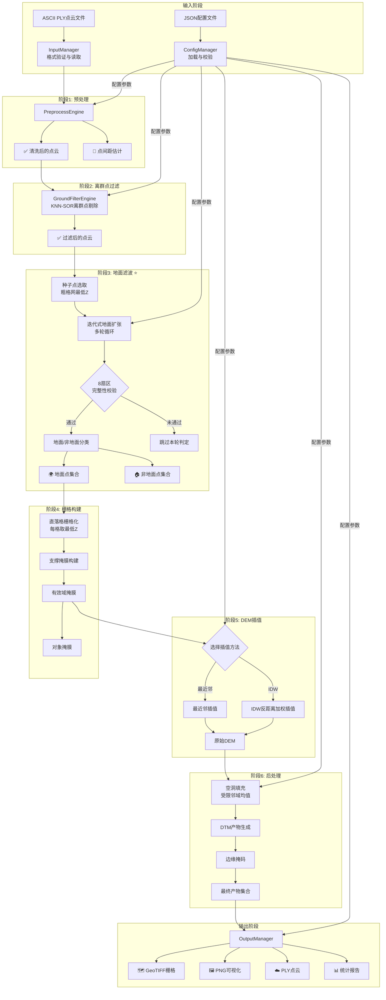

### 5.2 详细处理流水线

#### 完整执行序列

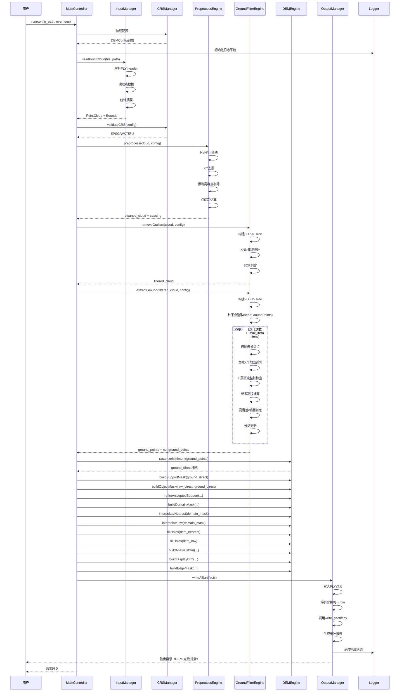

### 5.3 Tile分块处理流程

当点云数据量超过内存阈值时，系统自动切换到Tile分块模式：

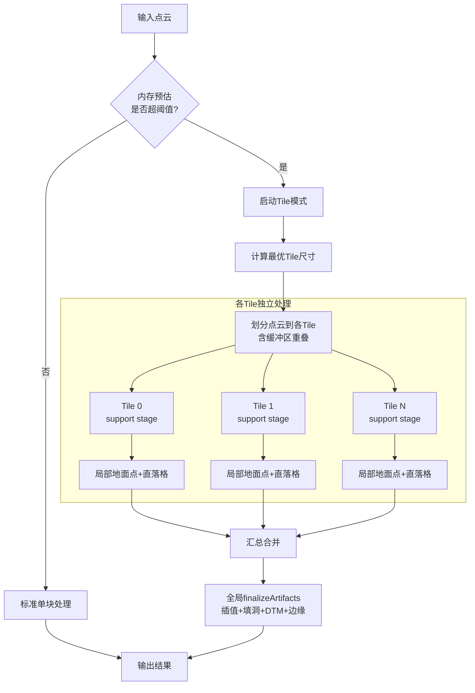

**Tile划分示意**:

```
┌──────────────────────────────────────────────────┐
│                    完整点云范围                    │
│                                                   │
│  ┌─────────┬─────────┬─────────┬─────────┐       │
│  │ Buffer  │ Buffer  │ Buffer  │ Buffer  │       │
│  │ ┌─────┐ │ ┌─────┐ │ ┌─────┐ │ ┌─────┐ │       │
│  │ │Tile 0│ │ │Tile 1│ │ │Tile 2│ │ │Tile 3│ │       │
│  │ │ 主区域│ │ │ 主区域│ │ │ 主区域│ │ │ 主区域│ │       │
│  │ └─────┘ │ └─────┘ │ └─────┘ │ └─────┘ │       │
│  │         │         │         │         │       │
│  ├─────────┼─────────┼─────────┼─────────┤       │
│  │ Buffer  │ Buffer  │ Buffer  │ Buffer  │       │
│  │ ...     │ ...     │ ...     │ ...     │       │
│  └─────────┴─────────┴─────────┴─────────┘       │
│                                                   │
│  缓冲区宽度 = tile_buffer_width                    │
│  各Tile的主区域互不重叠                             │
└──────────────────────────────────────────────────┘
```

---

## 6. 核心算法详解

### 6.1 地面滤波算法（核心创新）

本项目的地面滤波采用**改进的迭代式种子扩张算法**，针对卫星摄影测量点云的特性进行了专门优化。

#### 算法概览

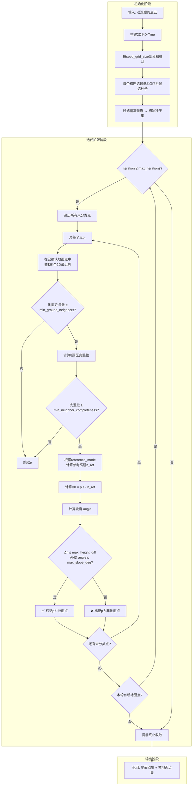

#### 子阶段A：种子点选取（seedGroundPoints）

**目标**: 从海量点云中快速筛选出一组可靠的初始地面点候选。

**算法步骤**:

```
输入: 点云 cloud, 格网尺寸 seed_grid_size
输出: 初始种子点集 seeds

1. 计算 point_cloud 的 XY 平面边界 bounds
2. 根据 seed_grid_size 和 bounds 计算格网行列数:
   ncols = ceil((xmax - xmin) / seed_grid_size)
   nrows = ceil((ymax - ymin) / seed_grid_size)
   
3. 将每个点分配到对应的格网单元 (grid_row, grid_col):
   grid_col = floor((x - xmin) / seed_grid_size)
   grid_row = floor((y - ymin) / seed_grid_size)

4. 对每个非空格网单元:
   a) 找到该单元内 Z 值最小的点
   b) 将其加入候选种子列表

5. 二次过滤（防止建筑物/树木顶部被选中）:
   a) 对每个候选种子，在其邻域内查找若干邻近点
   b) 若候选种子的Z值显著高于邻域最低Z → 过滤掉
   c) 否则 → 保留为正式种子

6. 返回经过滤的初始种子集
```

**参数影响**:
- `seed_grid_size` 较大 → 格网更粗，种子更稀疏但更可靠
- `seed_grid_size` 较小 → 格网更细，种子更密集但可能混入非地面点
- 设为 `0.0` 时自动按 `cell_size × 4` 计算

#### 子阶段B：迭代式地面点扩张（extractGround）

**目标**: 从种子点出发，逐步将符合条件的邻近点纳入地面点集。

**核心判定逻辑**:

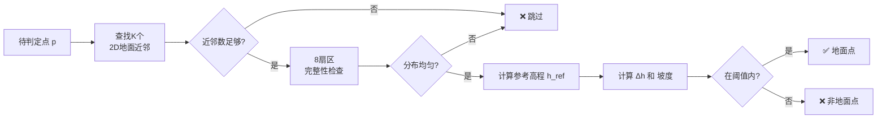

**三种参考高程计算模式**:

| 模式 | 计算公式 | 特点 | 适用场景 |
|------|----------|------|----------|
| **local_plane** | 最小二乘平面拟合 z=ax+by+c | 考虑地形趋势，最准确 | 一般地形 |
| **inverse_distance_squared** | 加权平均 Σ(wᵢzᵢ)/Σwᵢ, wᵢ=1/dⁿ | 平滑过渡，抗噪性好 | 噪声较多的数据 |
| **local_min** | min(z₁, z₂, ..., zₖ) | 最保守，只看最低点 | 平坦城市区域 |

**8扇区邻域完整性**:

```
          扇区0(0°~45°)
            ╱ │╲
          ╱   │  ╲
扇区7(315°~360°)  │  扇区1(45°~90°)
        ●─────┼─────●
        │  p   │     │
        │     │     │
扇区6(270°~315°)  │  扇区2(90°~135°)
          ╲   │  ╱
            ╲ │╱
          扇区5(225°~270°)
            │
          扇区4(180°~225°)
            │
          扇区3(135°~180°)

完整性 = 有地面近邻点的扇区数 / 8
例: 若8个扇区中有6个有分布 → 完整性 = 0.75
```

**作用**: 防止在数据边缘或空洞附近产生误分类。当某个点的地面近邻只集中在少数几个方向时，说明该点可能位于数据边界，此时不进行判定（留待后续迭代或保持未分类）。

#### 收敛机制

- **最大迭代次数保护**: 达到 `max_iterations` 后强制停止，防止无限循环
- **提前终止**: 若某轮迭代没有新增任何地面点，立即终止
- **典型收敛轮数**: 平坦区域3-4轮，复杂地形5-8轮

### 6.2 KNN离群点过滤算法

**全称**: Statistical Outlier Removal based on K-Nearest Neighbors

**原理**: 对每个点，计算其K个最近邻的3D平均距离。若该距离显著高于全局平均值，则认为该点是离群点（可能是噪声或异常测量）。

**算法流程**:

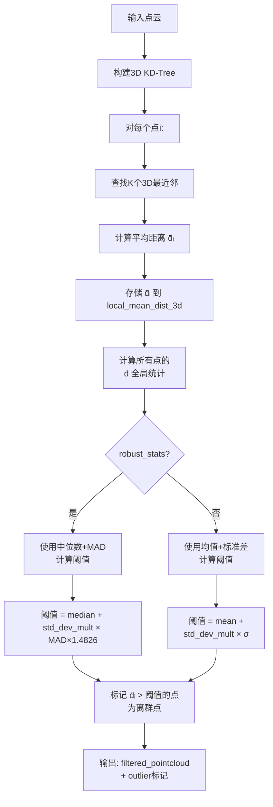

**鲁棒统计 vs 传统统计**:

| 方法 | 位置度量 | 离散度量 | 抗异常值能力 |
|------|----------|----------|-------------|
| 传统 | 均值 μ | 标准差 σ | 弱（异常值会拉高μ和σ） |
| 鲁棒 | 中位数 med | MAD（中位绝对偏差） | 强（不受极端值影响） |

**推荐**: 对于卫星摄影测量点云（可能存在大量噪声），建议开启 `outlier_robust_stats = true`。

### 6.3 DEM插值算法

#### 最近邻插值（interpolateNearest）

```
对有效域内的每个 NoData 单元格 cell:
    1. 在 ground_direct 栅格中搜索 nearest_max_distance 半径内的有效像元
    2. 取距离最近的那个像元的高程值
    3. 赋值给 cell
    
特点: 
    - 速度快（只需一次最近邻查询）
    - 保持原始高程值不变（无平滑效应）
    - 结果呈阶梯状（Voronoi剖分效果）
```

#### IDW反距离加权插值（interpolateIdw）

```
对有效域内的每个 NoData 单元格 cell:
    1. 在 idw_radius 半径内搜索有效的地面支撑点
    2. 取距离最近的 idw_max_points 个点（不少于 idw_min_points 个）
    3. 对每个邻居 i 计算权重: wᵢ = 1 / dᵢ^power
    4. 加权平均: z_cell = Σ(wᵢ × zᵢ) / Σ(wᵢ)
    5. 赋值给 cell
    
特点:
    - 结果平滑连续
    - 距离越近的点权重越大
    - power越大 → 近邻影响越强（结果越不平滑）
    - 可能过度平滑陡坎等地形特征
```

**两种方法对比**:

| 维度 | 最近邻 | IDW |
|------|--------|-----|
| **速度** | 快 | 较慢 |
| **平滑性** | 差（阶梯状） | 好（连续曲面） |
| **特征保持** | 强（保持原始值） | 弱（可能模糊细节） |
| **适用场景** | 陡峭地形、精度优先 | 平缓地形、视觉优先 |
| **NoData残留** | 可能较多 | 较少（加权填充能力强） |

### 6.4 空洞填充算法

**目标**: 插值后仍存在的NoData区域（通常是数据空洞内部），使用受限邻域均值进行填充。

**算法**:

```mermaid
flowchart TD
    A[输入: 插值后的DEM<br/>（含NoData区域）] --> B[初始化: 待填充队列<br/>= 所有NoData单元格]
    
    B --> C{队列非空?}
    C -- 是 --> D[取出一个NoData单元格cell]
    D --> E[在fill_max_radius范围内<br/>搜索有效邻居]
    E --> F{邻居数 ≥ fill_min_neighbors?}
    
    F -- 是 --> G[cell.value = mean(邻居值)]
    G --> H[标记cell为已填充]
    H --> I[从队列移除cell]
    
    F -- 否 --> J[cell保持NoData<br/>（无法填充）]
    J --> I
    
    I --> K{本轮有任何变化?}
    K -- 是 --> L{达到迭代上限?}
    L -- 否 --> C
    L -- 是 --> M[停止: 部分NoData残留]
    
    K -- 否 --> N[✅ 收敛: 全部填充完毕]
    C -- 否 --> N
```

**参数调优**:
- `fill_max_radius` 大 → 能填充更大的空洞，但可能引入不准确的外推值
- `fill_min_neighbors` 大 → 要求更多证据才填充，结果更保守
- 推荐组合: `fill_max_radius=2~3`, `fill_min_neighbors=3~4`

### 6.5 DTM产物生成算法

#### 分析型DTM（buildAnalysisDtm）

**用途**: 定量分析、精度评估、科学计算

**生成规则**:
```
对每个单元格:
    if 单元格 ∈ domain_mask AND 单元格 ∉ object_mask:
        value = dem_filled 的值（精确插值结果）
    else:
        value = nodata
```

**特点**:
- 仅在"确信是裸地"的区域保留值
- 建筑/树木/对象区域设为NoData
- 外部无数据区域也是NoData
- 适合做精度对比和统计分析

#### 展示型DTM（buildDisplayDtm）

**用途**: 可视化展示、制图出版、一般浏览

**生成规则**:
```
1. 以 analysis_dtm 为基础
2. 对内部的 NoData 区域（主要是对象区域）进行全域重建:
   - 使用较大的搜索半径寻找周围的有效地面点
   - IDW插值填充对象区域
3. 可选的高斯平滑（减少填充带来的不自然感）
```

**特点**:
- 全域有值（几乎无NoData）
- 对象区域被"合理猜测"的地形替代
- 视觉上连续美观
- **不适合定量分析**（对象区域的值是推测的）

#### 对象掩膜（buildObjectMask）

**用途**: 识别建筑、树木等高出地面的对象

**生成方法**:
```
1. 比较 raw_direct（所有点落格）和 ground_direct（地面点落格）
2. 对每个单元格计算残差: residual = raw_z - ground_z
3. 若 residual > 阈值 → 标记为对象
4. 形态学运算去除孤立噪声（可选）
```

---

## 7. 空间索引与性能优化

### 7.1 KD-Tree索引策略

本项目使用[nanoflann](https://github.com/jlblancoc/nanoflann)库提供的KD-Tree实现，针对不同场景选择不同的索引维度：

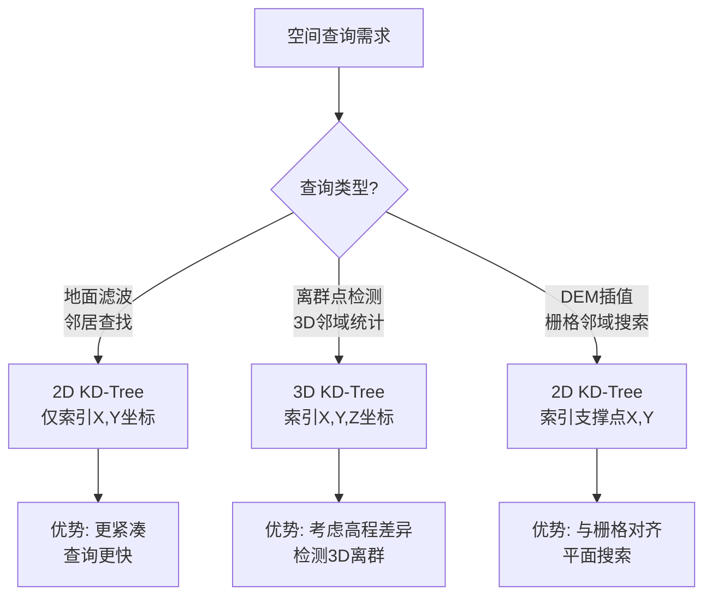

**索引生命周期管理**:

```cpp
// 伪代码示例
class SpatialIndexManager {
public:
    /**
     * @brief 创建2D索引用于地面滤波
     * 
     * 只索引x,y坐标，忽略z值。
     * 用于在已确认地面点中查找2D最近邻。
     */
    void build2DIndex(const PointCloud& ground_points);
    
    /**
     * @brief 创建3D索引用于离群点检测
     * 
     * 索引x,y,z全部坐标。
     * 用于3D邻域的平均距离统计。
     */
    void build3DIndex(const PointCloud& all_points);
    
    /**
     * @brief K近邻查询
     * @return 距离最近的K个点的索引和距离
     */
    std::vector<std::pair<size_t, double>> knnSearch(
        const Point3D& query, size_t k
    ) const;
    
    /**
     * @brief 固定半径查询
     * @return 半径内所有点的索引和距离
     */
    std::vector<std::pair<size_t, double>> radiusSearch(
        const Point3D& query, double radius
    ) const;
};
```

### 7.2 性能瓶颈与优化

| 处理阶段 | 主要操作 | 时间复杂度 | 优化策略 |
|----------|----------|-----------|----------|
| **预处理** | 遍历 + 去重 | O(N log N) | 基于网格的空间哈希去重 |
| **离群点过滤** | N次KNN查询 | O(N log N) | OpenMP并行查询 |
| **地面滤波** | 多轮迭代KNN | O(I × N log N) | 2D索引 + 提前终止 |
| **KD-Tree构建** | 点集建树 | O(N log N) | nanoflann已高度优化 |
| **直落格** | 点→栅格映射 | O(N) | 直接计算行列号 |
| **DEM插值** | 栅格单元查询 | O(R × C × log N) | 限制搜索半径 |
| **空洞填充** | 迭代邻域搜索 | O(H × R × C) | 限制填充半径和迭代次数 |

**符号说明**: N=点数, I=迭代次数, R×C=栅格尺寸, H=填充迭代次数

### 7.3 内存管理策略

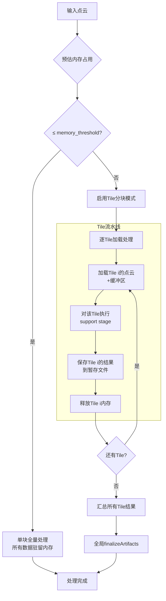

**内存估算公式**:
```
单个点内存 ≈ sizeof(Point3D) ≈ 120 bytes（含所有中间属性）
总内存 ≈ 点数 × 120 × 安全系数(1.5~2.0)

示例:
  1000万点 → 约 1.7~2.3 GB
  5000万点 → 约 8.6~11.5 GB（必须启用Tile模式）
```

---

## 8. 输出产物体系

### 8.1 产物分类树

```mermaid
graph TD
    ROOT[输出目录 output/<timestamp>/] --> DEM[dem/<br/>栅格产物]
    ROOT --> PC[pointcloud/<br/>点云产物]
    ROOT --> LOG[log/<br/>日志与报告]
    ROOT --> TILE[tile/<br/>分块暂存]

    DEM --> RAW[dem_raw_direct.tif/png<br/>预处理后直接落格]
    DEM --> GD[dem_ground_direct.tif/png<br/>地面点直接落格]
    DEM --> NN[dem_nearest.tif/png<br/>最近邻插值]
    DEM --> IDW[dem_idw.tif/png<br/>IDW插值]
    DEM --> NN_F[dem_nearest_filled.tif/png<br/>最近邻+填洞]
    DEM --> IDW_F[dem_idw_filled.tif/png<br/>IDW+填洞]
    DEM --> SM[dem_support_mask.tif/png<br/>支撑掩膜]
    DEM --> DM[dem_mask.tif/png<br/>有效域掩膜]
    DEM --> EM[dem_edge_mask.tif/png<br/>边缘掩码]
    DEM --> AD[dtm_analysis.tif/png<br/>分析型DTM]
    DEM --> DD[dtm_display.tif/png<br/>展示型DTM]
    DEM --> OM_D[dtm_object_mask.tif/png<br/>对象掩膜]

    PC --> FP[filtered_points.ply<br/>离群点过滤后]
    PC --> SP[seed_points.ply<br/>种子点]
    PC --> GP[ground_points.ply<br/>最终地面点]
    PC --> NGP[nonground_points.ply<br/>非地面点]

    LOG --> RL[run_log.txt<br/>运行日志]
    LOG --> CU[config_used.txt<br/>实际配置]
    LOG --> ST[stats.txt<br/>统计数据]
    LOG --> RJ[report.json<br/>JSON报告]

    TILE --> TF[tile_0.xyz ~ tile_N.xyz<br/>各Tile点云]
    TILE --> AG[aggregate/*.xyz<br/>汇总点云]
```

### 8.2 关键产物解读

| 产物 | 格式 | 用途 | 使用者 |
|------|------|------|--------|
| **dtm_analysis.tif** | GeoTIFF | 精确裸地高程，含NoData | GIS分析师、科研人员 |
| **dtm_display.tif** | GeoTIFF | 全域连续高程，视觉效果好 | 制图人员、展示汇报 |
| **ground_points.ply** | PLY | 分类后的地面点云 | 质检、二次加工 |
| **nonground_points.ply** | PLY | 非地面点（建筑/植被/噪声） | 对象检测、变化监测 |
| **dtm_object_mask.tif** | GeoTIFF | 高起伏对象的位置掩膜 | 建筑物提取、植被分析 |
| **dem_edge_mask.tif** | GeoTIFF | 结构性边缘区域标注 | 质量评估、后处理 |
| **report.json** | JSON | 完整的结构化处理报告 | 自动化流水线、存档 |

### 8.3 统计报告内容

**stats.txt 关键字段**:

```
=== 输入统计 ===
input_total_points = 12345678
input_valid_points = 12340000
input_bounds = [xmin, xmax, ymin, ymax, zmin, zmax]

=== 预处理统计 ===
pre_nan_removed = 5000
pre_duplicates_removed = 678
pre_extreme_outliers = 100
estimated_point_spacing = 1.23

=== 离群点过滤统计 ===
sor_knn_used = 20
sor_outliers_removed = 45678
sor_remaining_points = 12294222

=== 地面滤波统计 ===
seed_points_count = 15678
ground_points_count = 8923456 (72.6%)
nonground_points_count = 3370766 (27.4%)
iterations_completed = 5

=== 栅格统计 ===
grid_nrows = 1200
grid_ncols = 1800
cell_size = 2.0
ground_direct_active_ratio = 0.65
dem_mask_active_ratio = 0.72
object_mask_ratio = 0.08

=== 质量指标 ===
cell_size_vs_spacing_ratio = 1.63
edge_mask_ratio = 0.05
fill_hole_cells = 12345

=== 处理耗时 ===
total_time_sec = 125.67
io_time_sec = 15.23
compute_time_sec = 108.34
output_time_sec = 2.10
```

---

## 9. 配置系统设计

### 9.1 配置层级与优先级

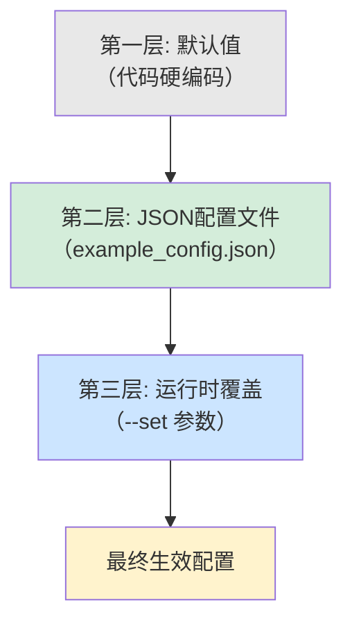

**优先级规则**: 运行时覆盖 > JSON配置 > 默认值

### 9.2 自动归一化机制

对于值为 `0.0` 或空的参数，系统会根据其他参数**自动计算合理的默认值**：

| 参数 | 自动计算规则 | 说明 |
|------|-------------|------|
| `seed_grid_size` | `cell_size × 4` | 种子格网约为DEM分辨率的4倍 |
| `search_radius` | `cell_size × 6` | 搜索半径约为6个栅格单元 |
| `nearest_max_distance` | `max(cell_size × 6, search_radius)` | 最近邻搜索半径 |
| `idw_radius` | `max(cell_size × 8, search_radius + 2×cell_size)` | IDW搜索半径更大 |
| `tile_buffer_width` | `search_radius × 1.5` | 缓冲区需覆盖搜索半径 |

这种设计让用户在大多数情况下只需设置 `cell_size` 一个核心参数即可获得合理的结果。

### 9.3 运行时参数覆盖语法

```bash
# 基本用法
--set <parameter_path>=<value>

# 支持嵌套路径（点分隔）
--set dem.cell_size=2.0
--set ground.max_height_diff=0.5
--set output.write_png=false

# 组合使用
--set dem.cell_size=2.0 --set ground.max_iterations=8

# 示例: 快速测试不同分辨率
for res in 1.0 2.0 4.0 8.0; do
    ./dem_cli.exe config.json --set dem.cell_size=$res
done
```

---

## 10. 批量处理框架

### 10.1 架构设计

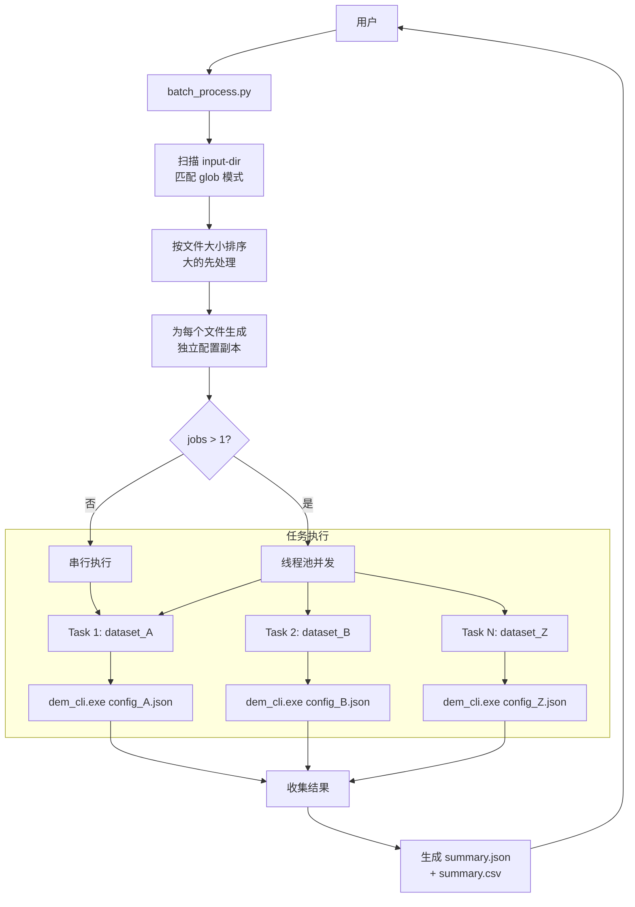

### 10.2 并发安全保证

- 每个数据集使用**独立的输出子目录**
- 每个数据集使用**独立的配置副本**（自动修改input.file_path）
- 每个数据集**独立的进程空间**（subprocess调用）
- 失败的任务**不会阻塞**其他任务的执行
- 最终汇总报告**记录所有成功/失败状态**

### 10.3 汇总报告格式

**summary.json**:
```json
{
    "batch_timestamp": "20260406_183045",
    "total_datasets": 10,
    "successful": 9,
    "failed": 1,
    "datasets": [
        {
            "name": "dataset_01",
            "status": "success",
            "duration_seconds": 125.67,
            "output_path": "output/batch_xxx/dataset_01/",
            "config_file": "configs/dataset_01.json"
        },
        {
            "name": "dataset_05",
            "status": "failed",
            "error_message": "Unable to open input file",
            "duration_seconds": 0.5
        }
    ]
}
```

---

## 11. 质量控制机制

### 11.1 内置质量检查点


### 11.2 告警等级

| 等级 | 含义 | 处理方式 |
|------|------|----------|
| **Info** | 正常处理进度信息 | 记录到日志 |
| **Warning** | 潜在质量问题，不影响继续 | 记录到日志 + stats.txt |
| **Error** | 致命错误，无法继续 | 记录日志 + 返回非零退出码 |

### 11.3 可复现性保障

每次运行都会输出以下文件以确保实验可复现：

1. **config_used.txt**: 实际使用的完整配置（包括自动计算的参数和运行时覆盖）
2. **run_log.txt**: 详细的时间戳日志，记录每个阶段的开始/结束时间
3. **report.json**: 包含版本号、完整参数、输入输出哈希等元数据

---

## 12. 应用场景与优势

### 12.1 目标应用场景

| 场景 | 说明 | 本项目优势 |
|------|------|-----------|
| **卫星摄影测量DEM生产** | 从立体影像匹配点云生成DTM | 针对性优化的地面滤波算法 |
| **地形分析与制图** | 生成基础地理数据产品 | 多种DTM产物满足不同需求 |
| **变化检测前期处理** | 多时相DEM对比的基础 | 可批量处理 + 一致性配置 |
| **科研与教学** | 算法研究和教学演示 | 开源、可配置、详细的文档 |
| **嵌入式/边缘计算** | 轻量级部署环境 | 无GUI依赖、低资源占用 |

### 12.2 相比现有方案的优势

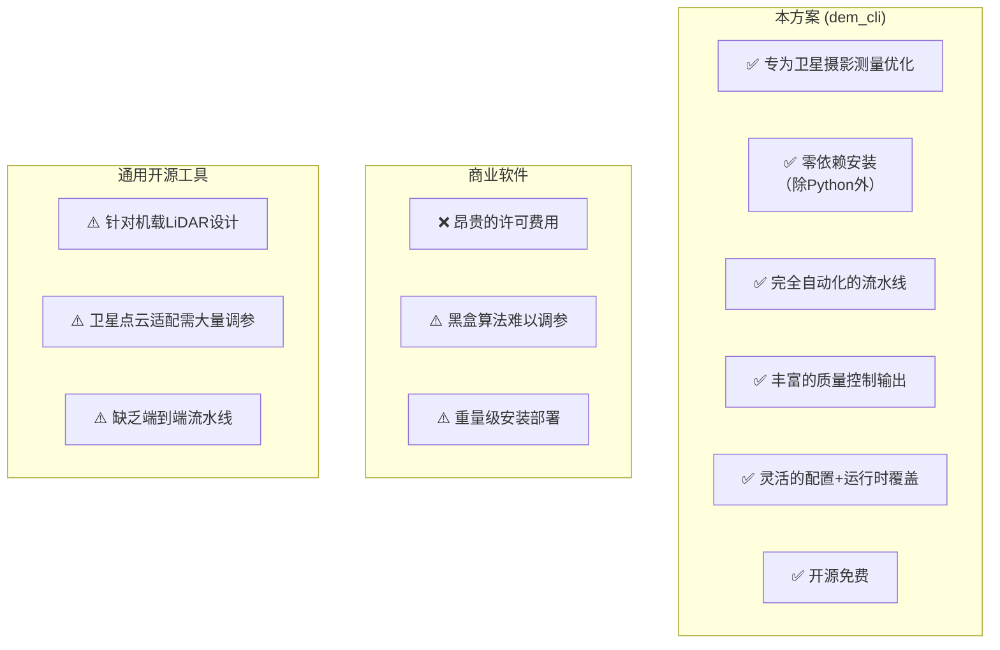

### 12.3 典型性能表现

| 数据规模 | 点数 | 处理时间* | 内存占用** |
|----------|------|-----------|-----------|
| 小规模 | ~100万 | ~5-15秒 | ~200MB |
| 中规模 | ~1000万 | ~30-90秒 | ~1.5GB |
| 大规模 | ~5000万 | ~3-8分钟 | ~2GB（Tile模式） |
| 超大规模 | ~1亿+ | ~10-25分钟 | ~2GB（Tile模式） |

\* 处理时间取决于CPU性能和参数设置  
\*\* 内存占用取决于是否启用Tile模式

---

## 13. 未来扩展方向

### 13.1 短期计划（v0.2）

- [ ] **二进制PLY支持**: 提升大文件读取速度（预计提速5-10倍）
- [ ] **原生GeoTIFF后端**: 接入libtiff + libgeotiff + PROJ，消除Python依赖
- [ ] **多线程流水线**: 各阶段（预处理/滤波/插值）并行执行
- [ ] **LAS/LAZ格式支持**: 拓展到LiDAR点云领域

### 13.2 中期计划（v0.3）

- [ ] **GPU加速**: CUDA/OpenCL加速KD-Tree查询和栅格插值
- [ ] **增量处理**: 支持在新数据到来时增量更新已有DEM
- [ ] **机器学习地面滤波**: 集成深度学习模型作为备选滤波器
- [ ] **Web服务模式**: 提供HTTP API接口，支持远程调用

### 13.3 长期愿景

- [ ] **实时处理流**: 支持从数据流（如消息队列）中持续消费和处理点云
- [ ] **分布式处理**: 支持集群环境下的大规模并行处理
- [ ] **可视化调试器**: GUI工具，支持中间结果的交互式查看和参数调整
- [ ] **完整的产品化**: 打包为跨平台安装包，提供图形配置界面

---

## 附录

### A. 项目文件清单

```
hl_code/
├── CMakeLists.txt                 # 构建配置
├── README.md                      # 项目概览
├── 使用说明文档.md                # 详细使用手册
├── 项目介绍.md                    # 本文档 ←
├── config/
│   └── example_config.json        # 示例配置
├── data/                          # 输入数据目录
├── include/dem/                   # 头文件（14个）
│   ├── Types.hpp                  # 核心数据结构
│   ├── MainController.hpp         # 主控制器
│   ├── InputManager.hpp           # 输入管理
│   ├── PreprocessEngine.hpp       # 预处理
│   ├── GroundFilterEngine.hpp     # 地面滤波
│   ├── DEMEngine.hpp              # DEM引擎
│   ├── SpatialIndexManager.hpp    # 空间索引
│   ├── TileManager.hpp            # 分块管理
│   ├── CRSManager.hpp             # 坐标系
│   ├── Config.hpp                 # 配置管理
│   ├── OutputManager.hpp          # 输出管理
│   ├── Logger.hpp                 # 日志
│   └── Utils.hpp                  # 工具函数
├── src/                           # 实现源文件（与头文件对应）
├── scripts/
│   ├── batch_process.py           # 批量处理
│   └── write_geotiff.py           # GeoTIFF/PNG写入
└── tests/                         # 单元测试
```

### B. 版本历史

| 版本 | 日期 | 主要变更 |
|------|------|----------|
| 0.1.0 | 2026-04-06 | 初始版本，完整功能实现 |

### C. 致谢与参考

- **nanoflann**: 高效的KD-Tree实现 ([GitHub](https://github.com/jlblancoc/nanoflann))
- **nlohmann/json**: 现代化JSON库 ([GitHub](https://github.com/nlohmann/json))
- **doctest**: 轻量级测试框架 ([GitHub](https://github.com/doctest/doctest))
- **rasterio**: Python地理空间I/O ([文档](https://rasterio.readthedocs.io/))

---

> **文档维护**: 本文档随项目代码同步更新，如有疑问请查阅源代码或提交Issue。
> 
> **最后更新**: 2026-04-06
